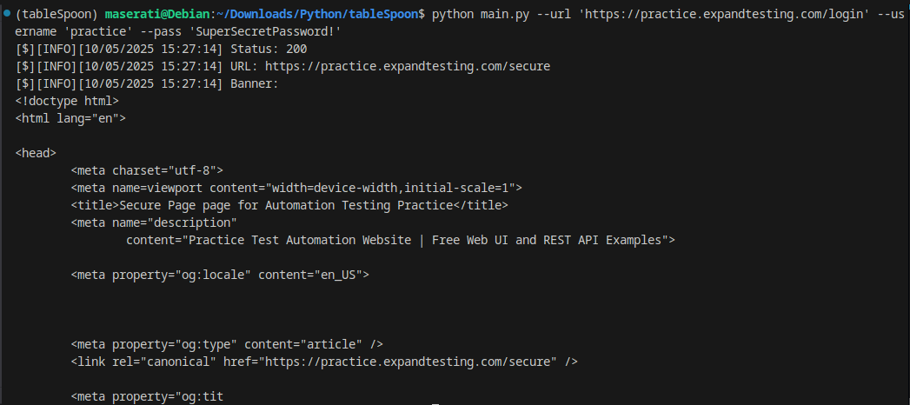

[](https://opensource.org/licenses/MIT)
[](https://github.com/bluurw/carbon/issues)

# **Table Spoon**

## **Descrição**

Table Spoon e uma ferramenta de identificacao e requisicao de formularios de login que pode ser utilizada para brute force.

## **Como Instalar**

Siga os passos abaixo para instalar e executar o projeto:

Clone o repositório
```bash
git clone https://github.com/bluurw/tableSpoon.git
```

Entre na pasta do projeto
```bash
cd tableSpoon
```

Crie um ambiente virtual (opcional, mas recomendado)
```bash
python3 -m venv venv
source venv/bin/activate
```

Instale as dependências
```bash
pip install -r requirements.txt
```

Execute o código principal
```bash
python main.py --url 'https://practice.expandtesting.com/login' --user 'practice' --passw 'SuperSecretPassword!'
```



## **TO DO**

- User-Agent Dinamico

## **Compatibilidade**
- Linux: OK
- Windows: Não testado
- Mac: Não testado

## **Licença**

Este projeto é licenciado sob a Licenca do MIT.